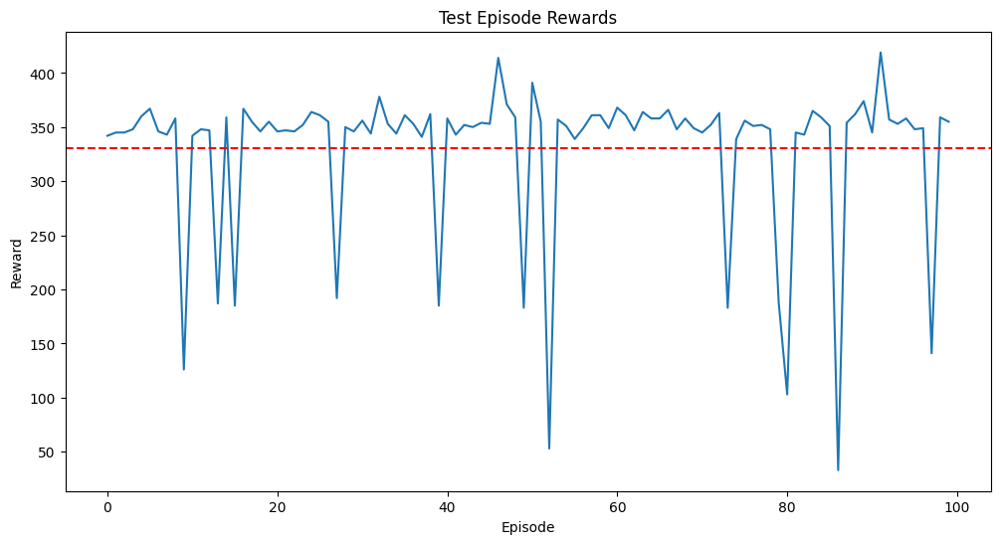
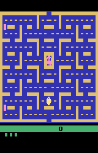
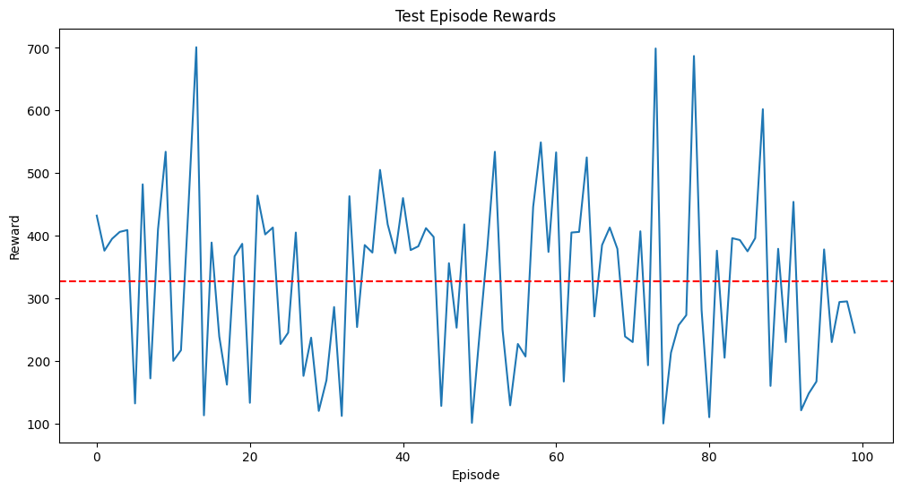

# PROJECT - PACMAN
This repository contains the files used to train agent to play [Pacman](https://ale.farama.org/environments/pacman/)

# Table of Contents

- [Introduction](#introduction)
- [The Game](#the-game)
    - [Action Space](#action-space)
    - [Observation Space](#observation-space)
- [Untrained Agent](#untrained-agent)
- [Training](#training)
    - [Requirements](#requirements)
    - [Training - PPO](#training---ppo)
        - [Training](#training-ppo)
        - [Results](#results-ppo)
    - [Training - A2C](#training---a2c)
        - [Training](#training-a2c)
        - [Results](#results-a2c)
- [Conclusion](#conclusion)

## The game:
Pac-Man is a classic video game where players control a yellow, circular character navigating a maze to eat pellets while avoiding ghosts. The game challenges players to strategize, collect bonus items, and clear levels by consuming all pellets while using power pellets to temporarily defeat ghosts.
- Small pellets (yellow): +1
- Power pellets (pink): +5
- After consuming a power pellet, Pac-Man can eat ghosts (while they are blue). 
The first ghost provides a reward of +20, and the reward doubles for each additional ghost eaten.
In each episode, the player has 3 lives, represented by green squares at the bottom-left corner of the environment. The episode ends when the player loses all three lives by being caught by the ghosts or completes the level by consuming all the pellets in the maze.

### Action space:
Pacman's action space is Discrete(5). The different actions correspond to:
- 0: NOOP
- 1: UP
- 2: RIGHT
- 3: LEFT
- 4: DOWN

### Observation space:
Observation space is Box(0, 255, (250, 160, 3), uint8). An array with shape (210, 160, 3) where each
element is an integer between 0 and 255

## Untrained agent:
First and foremost, we wanted to see how an untrained agent would perform to have an ide on how the game worked. The untrained agent typically gets a score within the range of 10 to 30. Occasionally, it exceeds this range, achieving rewards between 50 and 100.
The gifs below represents an untrained agent. 

  

## Training:
We decided to tackle this part of the project with 2 different algorithms:
- A2C
- PPO

### Requirements:
The code requires the following libraries:
- Python 3.8+
- PyTorch
- Gymnasium (with ALE for Atari games)
- OpenCV
- Matplotlib
- NumPy
- Pillow
- Weights & Biases (WandB) for tracking experiments

to install them all, you can use:
`pip install torch gymnasium ale-py shimmy numpy matplotlib opencv-python pillow wandb`

To play Atari games like Pong and Pac-Man, install the additional Gymnasium components with Atari support:
`pip install gymnasium[atari,accept-rom-license]`

## Training - PPO:

Similarly to, and for the same reason as, the skiing training, the parameters used in this algorithm have been the default values from PPO. 

### Training:

The hyperparameters used are the following ones:
- policy = ”CnnPolicy”: This specifies a convolutional neural network policy, which is suitable for environments with image-based inputs.
- learning rate = 0.0005: A small learning rate that ensures gradual updates to the model, pre-venting unstable training.
- gamma = 0.99: A high discount factor that emphasizes long-term rewards in decision-making.
- gae lambda = 0.95
- n steps = 128
- ent coef = 0.01
- vf coef = 0.5
- clip range = 0.2
- clip range vf = 1
- n epochs = 6
- batch size = 128
- max grad norm = 0.4
- total timesteps = 2000000: Set to a high number to allow the agent to train for as long as necessary. The training is manually stopped if needed.

The model is saved every 2000 timesteps in order to have backups and it is evaluated every 1000 timesteps and only saved if the evaluation results are better than the best result. 

### Results:
The model is in the folder under the name "[ppo_best_model](ppo_best_model.zip)". 

After 100 episodes of testing, we see a clear improvement of the agent's behavior compared to the untrained agent. When untrained, the rewards range between 10 and 30 while in the agent trained with PPO, the scores ranged from 100 to 400 being the mean reward of 320. 

     

## Training - A2C:

### Training:

The hyperparameters for this section of the training are the following ones:
- policy = ’CnnPolicy’
- learning rate = 0.0005
- gamma = 0.99
- n steps = 64
- vf coef = 0.5
- ent coef = 0.01
- max grad norm = 0.4
- total timesteps = 3000000

The model is saved every 2000 timesteps in order to have backups and it is evaluated every 1000 timesteps and only saved if the evaluation results are better than the best result saved so far. 

### Results:
The model is in the folder under the name "[a2c_best_model](a2c_best_model.zip)"

As usual, the model was tested with 100 episodes. The improvement over the untrained agent is greater than the one obtained with the PPO. The rewards range between 100 and 700 with a mean test reward of 350. 

     

## Conclusion:
PPO demonstrates more consistent rewards, stabilizing around 400 points, but struggles to achieve higher scores. In contrast, A2C exhibits a broader range of rewards, with some runs reaching up to 700 points. Despite these differences in performance patterns, the average rewards for both algorithms are similar, indicating that their overall performance is comparable.
An analysis of the executions detailed in this report reveals that PPO takes significantly longer to converge compared to A2C. 
However, due to the inherent stochasticity of the environment, direct comparisons are challenging. Identical executions with the same parameters can yield highly variable performances, complicating a definitive evaluation of the algorithms.